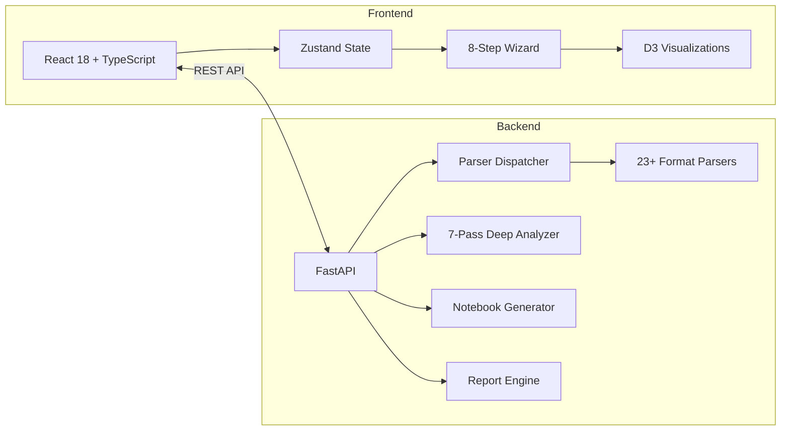

# Universal ETL Migration Platform

[](https://www.python.org/downloads/)
[](https://fastapi.tiangolo.com/)
[](https://react.dev/)
[](LICENSE)

A full-stack platform that analyzes ETL flow definitions and generates migration plans to **Databricks notebooks and workflows**. Upload a NiFi XML/JSON, Airflow DAG, SSIS package, or 20+ other formats and get an 8-step migration assessment with runnable code.

## Features

- **23+ ETL Platform Support** - NiFi (XML, JSON, 2.x), Airflow, SSIS, Informatica, dbt, AWS Glue, Azure Data Factory, Talend, and more
- **7-Pass Deep Analysis** - Functional, processor, workflow, upstream, downstream, line-by-line, and flow lint analysis
- **SQL Dialect Transpilation** - Automatic HiveQL/MySQL/Oracle/PostgreSQL to Spark SQL conversion via SQLGlot AST
- **Flow Linting** - 30 configurable rules detecting anti-patterns, security issues, and migration blockers
- **Data Lineage Visualization** - Interactive D3 graph and Mermaid diagrams showing source-to-sink data flow
- **12-Point Runnable Quality Gate** - Validates generated notebooks are production-ready
- **Compatibility Matrix** - Per-processor compatibility assessment (native/partial/manual/unsupported)
- **Effort Estimation** - Per-component hours, critical path, team skill requirements
- **ROI Analysis** - Monte Carlo simulation, TCO, FTE impact, license savings
- **Live NiFi Connection** - Connect directly to a running NiFi instance via NiPyApi (optional)
- **Export** - Databricks Asset Bundles (DAB), PDF reports, Markdown

## Architecture



| Layer | Stack |
|-------|-------|
| Frontend | React 18, TypeScript, Zustand, D3 7.9, Tailwind CSS, Vite |
| Backend | FastAPI, Pydantic v2, SQLAlchemy, NetworkX, SQLGlot |
| Analysis | 7-pass deep analysis, flow linting, SQL transpilation |
| Visualization | D3 force graphs, Mermaid diagrams, confidence charts |

## Quick Start

### Docker (recommended)

```bash
docker compose up
```

- Frontend: http://localhost:5174
- Backend API: http://localhost:8000/docs

### Manual Setup

**Backend:**

```bash
cd backend
pip install -e ".[all]"    # includes sqlglot + nipyapi + dev tools
uvicorn app.main:app --reload --port 8000
```

**Frontend:**

```bash
cd frontend
npm install
npm run dev
```

### Optional Dependencies

| Package | Install | Purpose |
|---------|---------|---------|
| SQLGlot | `pip install -e ".[sql]"` | SQL dialect transpilation (HiveQL, MySQL, Oracle -> Spark SQL) |
| NiPyApi | `pip install -e ".[nifi]"` | Live NiFi instance connection |

## Supported Platforms

| Platform | Format | Status |
|----------|--------|--------|
| Apache NiFi 1.x | XML template, JSON (Registry) | Full support |
| Apache NiFi 2.x | JSON (`flow.json.gz`) | Full support |
| Apache Airflow | Python DAG files | Full support |
| Microsoft SSIS | `.dtsx` XML packages | Full support |
| Informatica PowerCenter | XML exports | Full support |
| dbt | `manifest.json` | Full support |
| AWS Glue | JSON job definitions | Full support |
| Azure Data Factory | JSON pipeline definitions | Full support |
| Talend | `.zip` archives | Full support |
| Matillion | JSON exports | Full support |
| Oracle ODI | XML exports | Full support |
| Snowflake (SQL) | SQL scripts | Partial |
| Prefect | Python flows | Partial |
| Dagster | Python pipelines | Partial |
| Apache Spark | PySpark scripts | Partial |

## 8-Step Migration Pipeline

1. **Parse** - Upload file, auto-detect platform, extract processors/connections
2. **Analyze** - 7-pass deep analysis (functional, processor, workflow, upstream, downstream, line-by-line, lint)
3. **Assess & Map** - Map source processors to Databricks equivalents with confidence scores
4. **Convert** - Generate Databricks notebook with PySpark/Spark SQL code
5. **Migration Report** - Gap playbook, risk matrix, implementation timeline
6. **Final Report** - Executive summary, compatibility matrix, effort estimates
7. **Validate** - 12-point runnable quality gate
8. **Value Analysis** - ROI, droppable processors, implementation roadmap

## API Documentation

Once the backend is running, interactive API docs are available at:

- Swagger UI: http://localhost:8000/docs
- ReDoc: http://localhost:8000/redoc

### Key Endpoints

| Endpoint | Method | Description |
|----------|--------|-------------|
| `/api/parse` | POST | Upload and parse ETL file |
| `/api/analyze/deep` | POST | Run 7-pass deep analysis |
| `/api/assess` | POST | Map processors to Databricks |
| `/api/generate` | POST | Generate Databricks notebook |
| `/api/validate` | POST | Run 12-point quality gate |
| `/api/report` | POST | Generate migration/final/value/ROI reports |
| `/api/lineage` | POST | Build data lineage graph |
| `/api/nifi/connect` | POST | Test live NiFi connection |
| `/api/nifi/extract` | POST | Extract flow from live NiFi |
| `/api/pipeline/run` | POST | Run full 8-step pipeline |

## Development

```bash
# Backend tests
cd backend
pip install -e ".[dev]"
python -m pytest tests/ -q

# Frontend type check + lint
cd frontend
npm run lint
npx tsc --noEmit

# Frontend tests
npm test
```

## Project Structure

```
docs/nifi-analyzer/
  backend/
    app/
      engines/
        parsers/        # 23+ format parsers + dispatcher
        analyzers/      # Deep analysis, lineage, linting, security
        generators/     # Notebook code generation
        reporters/      # ROI, TCO, compatibility, effort estimation
        transformers/   # SQL transpilation (SQLGlot)
      routers/          # FastAPI route handlers
      models/           # Pydantic models
      auth/             # JWT, RBAC, API keys
      db/               # SQLAlchemy models + engine
      constants/        # Processor maps, lint rules (YAML)
  frontend/
    src/
      components/
        steps/          # 8-step wizard components
        viz/            # D3, Mermaid, chart visualizations
        shared/         # Reusable UI components
      store/            # Zustand state management
      hooks/            # Custom React hooks
      api/              # Backend API client
      types/            # TypeScript type definitions
```

## License

This project is licensed under the Apache License 2.0 - see the [LICENSE](LICENSE) file for details.
